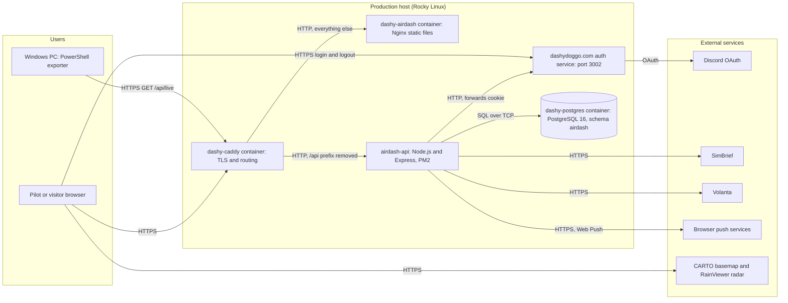
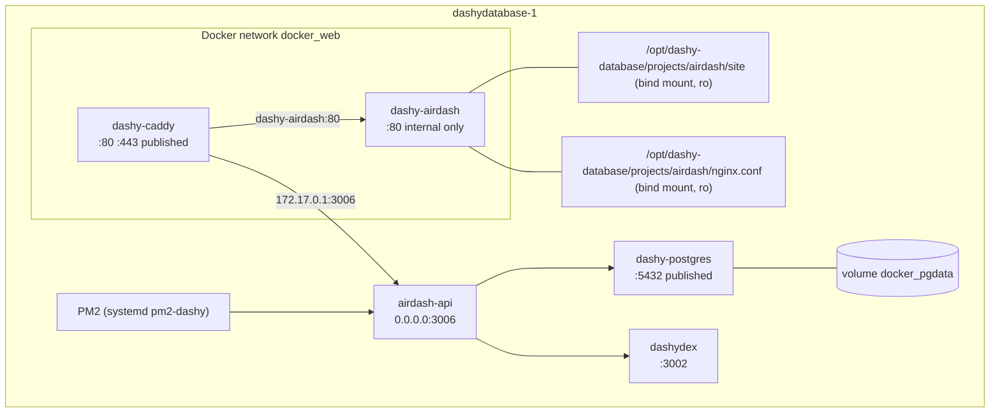
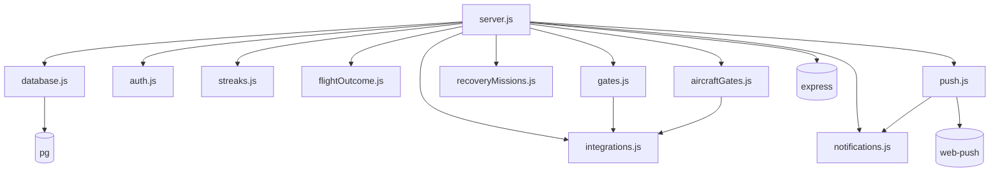
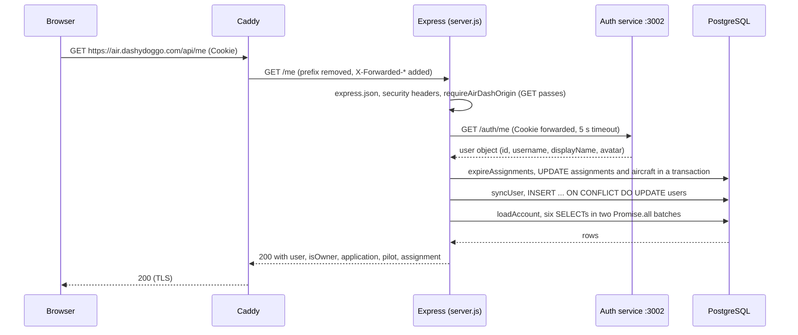
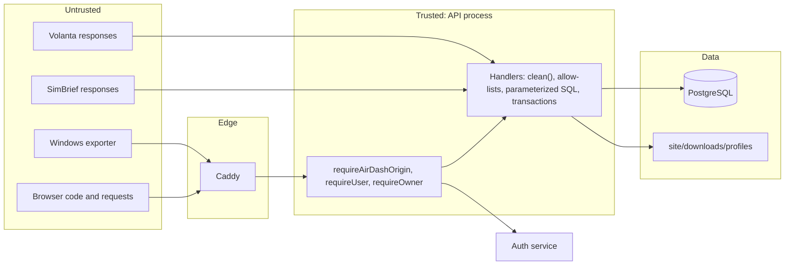

# Architecture

airDash is a single-page React application served as static files, backed by one Express API process that owns all business rules, and a PostgreSQL schema that stores all durable state. Production combines two host processes (the API under PM2 and the shared Discord authentication service) with three Docker containers (Caddy, Nginx, and PostgreSQL). This page is the canonical description of the components, the flows between them, the boundaries that protect them, and the tradeoffs that shaped them. It describes the implementation at commit `5f2e27c`, not the earlier plan in [platform design](designdoc.md).

## System context

The following diagram shows airDash in its environment. Every arrow is a network call, labeled with its direction and protocol.



Reading the diagram: browsers and the Windows automation reach only Caddy, which is the single public entry point on ports 80 and 443. Caddy splits traffic by path: `/api/*` goes to the API process on the host, everything else to the Nginx container that serves the built frontend. The API is the only component that talks to PostgreSQL, to the authentication service, and to SimBrief and Volanta. The browser talks directly to the map tile providers and to the dashydoggo.com login endpoints, which are separate services on the same parent domain. Push messages travel from the API to the browser vendor's push service and from there to the browser, not through Caddy.

## Components and responsibilities

| Component | Runtime | Resource | Responsibility | Depends on |
|---|---|---|---|---|
| Edge proxy | Docker | `dashy-caddy`, image `caddy:alpine`, config `/opt/dashy-database/configs/Caddyfile` | Terminates TLS for every dashydoggo.com subdomain; routes airDash traffic by path; removes the `/api` prefix. | Nginx container, API process |
| Static frontend | Docker | `dashy-airdash`, image `nginx:alpine`, config `nginx.conf` | Serves `site/` read-only with per-path cache headers; falls back to `index.html` for client routes. | `site/` bind mount |
| API | Host, PM2 | `airdash-api`, `api/src/server.js`, port 3006 | All business rules: authentication delegation, authorization, validation, transactions, background jobs, integrations, notifications, push delivery, migrations. | PostgreSQL, auth service, SimBrief, Volanta, push services |
| Database | Docker | `dashy-postgres`, image `pgvector/pgvector:pg16`, database `dashyden`, schema `airdash`, volume `docker_pgdata` | Durable state and integrity constraints. Shared with other homelab services. | none |
| Authentication service | Host, PM2 | `dashydex` (the Discord bot process), port 3002, endpoint `/auth/me` | Converts the dashydoggo.com session cookie into a Discord user object. Owned by a different project. | Discord |
| Browser application | User device | React bundle from `site/app-assets/` | Renders pages, holds transient state, polls notifications, registers the service worker, calls `/api`. | API, tile providers |
| Service worker | User device | `site/airdash-sw.js` | Displays push notifications, marks them read on click, renews subscriptions. | API |
| Windows automation | Windows desktop | `scripts/*.ps1`, PowerPoint COM | Reads `/api/live` and renders the simulator start video. | API (public route only) |
| Process supervision | Host | PM2 7.0.1, systemd unit `pm2-dashy.service` | Restarts the API on failure, resurrects it at boot. | none |

## Production runtime topology



The Nginx container publishes no host port; Caddy reaches it by container name over the `docker_web` network, which is why recreating the container requires `--network docker_web`. The API is not containerized, so Caddy reaches it through the Docker bridge gateway address `172.17.0.1`, which is the host as seen from inside a container. PostgreSQL publishes port 5432 on the host so that the API and administrative tools can connect. The `site/` directory is bind-mounted read-only, so a frontend build on the host is visible to Nginx immediately without a restart, and the container cannot modify the files.

Every fact in the two diagrams above was confirmed on September 10, 2026 with `docker ps`, `docker inspect dashy-airdash`, `pm2 jlist`, `systemctl is-active pm2-dashy`, `ss -ltnp`, and the Caddyfile.

## Source layout

```text
airdash/
├── README.md
├── .gitattributes
├── .gitignore
├── nginx.conf
├── api/
│   ├── .env                      (not tracked; production credentials)
│   ├── .env.example
│   ├── ecosystem.config.js
│   ├── package.json
│   ├── package-lock.json
│   ├── scripts/
│   │   ├── migrate.js
│   │   ├── test-flight-outcomes.js
│   │   └── test-streaks.js
│   └── src/
│       ├── server.js             (Express app, 57 routes, jobs, startup)
│       ├── database.js           (pool, migrate, seeds, audit, publishOrgUpdate)
│       ├── auth.js               (authenticatedUser, requireUser, requireOwner, requireAirDashOrigin)
│       ├── integrations.js       (gate pools, SimBrief, Volanta)
│       ├── streaks.js            (flight-day and continuity streaks, bonus)
│       ├── flightOutcome.js      (COMPLETED, DIVERTED, INCOMPLETE analysis)
│       ├── notifications.js      (payload queries, history sync, mark read)
│       ├── push.js               (VAPID, subscriptions, delivery, worker)
│       ├── recoveryMissions.js   (recovery ferries, SimBrief params, XP multiplier)
│       ├── gates.js              (repair missing assignment gates at startup)
│       └── aircraftGates.js      (parking gate selection and repair)
├── web/
│   ├── index.html
│   ├── package.json
│   ├── package-lock.json
│   ├── vite.config.ts
│   ├── tsconfig.json
│   ├── tsconfig.app.json
│   ├── public/
│   │   ├── airdash-sw.js         (service worker, copied to site/)
│   │   └── assets/               (logo, favicon, imagery, news art, showcase media)
│   └── src/
│       ├── main.tsx              (mounts App inside BrowserRouter)
│       ├── App.tsx               (context, Layout, all pages, routes)
│       ├── AdvancedNetworkMap.tsx (network map with radar and estimated positions)
│       ├── News.tsx              (LatestNews, NewsHub, NewsArticle)
│       ├── HomeMedia.tsx         (home page video and screenshot showcase)
│       ├── api.ts                (fetch wrapper and ApiError)
│       ├── types.ts              (API response interfaces)
│       ├── airportData.ts        (airport names and coordinates)
│       ├── flightPlan.ts         (VATSIM pre-file URL and remark)
│       ├── hangarQuips.ts        (Hangar heading phrases)
│       ├── volanta.ts            (volanta:// desktop launch)
│       ├── webPush.ts            (subscribe, unsubscribe, test push)
│       ├── browserNotifications.ts (Web Notifications API opt-in)
│       ├── notificationState.ts  (types; legacy fingerprint helpers, unused)
│       ├── styles.css            (complete stylesheet)
│       └── vite-env.d.ts
├── docs/
├── gsx/                          (GSX ground handling package sources)
├── livery-templates/             (structural files for MSFS 2020 livery builds)
├── scripts/                      (PowerShell automation, livery builder, demo data)
└── site/                         (not tracked; build output plus downloads)
    ├── index.html
    ├── airdash-sw.js
    ├── app-assets/
    ├── assets/
    ├── downloads/
    │   ├── liveries/
    │   ├── gsx/
    │   └── profiles/
    └── .publication-archive/
```

The [repository guide](repository-guide.md) describes each entry, states whether it is handwritten or generated, and traces an execution path.

## Frontend architecture

The frontend is React 19 with TypeScript 6, bundled by Vite 8 into one JavaScript file and one CSS file. It uses React Router 7 for client-side routing, Framer Motion for animation, Leaflet and React Leaflet for maps, and React Icons for iconography.

### Application shell

`web/src/main.tsx` creates the React root inside `<div id="root">` from `web/index.html`, wraps `App` in `StrictMode` and `BrowserRouter`, and imports the Leaflet stylesheet and `styles.css`.

`App` in `web/src/App.tsx` owns shared state and exposes it through `AppContext`:

| Field | Type | Source |
|---|---|---|
| `publicData` | `PublicResponse` | `GET /public` on load and on `refresh()` |
| `me` | `MeResponse` or `null` | `GET /me` on load and on `refresh()`; `null` when not signed in |
| `loading` | boolean | true until the first load completes |
| `notifications` | `NotificationPayload` or `null` | `GET /notifications` or `GET /admin/notifications` every 60 seconds while signed in |
| `refresh`, `notify`, `markNotificationsRead`, `refreshNotifications`, `openBrief` | functions | Shared actions |

`Layout` renders the top bar, navigation, notification bell, profile menu, page body, and footer. Navigation is two arrays, `primaryLinks` and `secondaryLinks`, whose contents depend on whether `me.pilot` exists and whether `me.isOwner` is true.

### Routing

`App` declares one `<Route>` per page. Nginx returns `index.html` for any path that is not a file, so a direct request to `/portal` loads the application and React Router renders `Portal`. The catch-all route `*` renders `Home`.

| Path | Component | File |
|---|---|---|
| `/` | `Home` | `App.tsx` |
| `/news`, `/news/:slug` | `NewsHub`, `NewsArticle` | `News.tsx` |
| `/join` | `Join` | `App.tsx` |
| `/portal` | `Portal` (the Hangar) | `App.tsx` |
| `/announcements` | `Announcements` | `App.tsx` |
| `/flights` | `Flights` | `App.tsx` |
| `/schedule` | `Schedule` | `App.tsx` |
| `/missions` | `Missions` | `App.tsx` |
| `/map` | `NetworkMapPage` wrapping `AdvancedNetworkMap` | `App.tsx`, `AdvancedNetworkMap.tsx` |
| `/report` | `Report` | `App.tsx` |
| `/profile` | `Profile` | `App.tsx` |
| `/pilots` | `Pilots` | `App.tsx` |
| `/fleet` | `Fleet` | `App.tsx` |
| `/health` | `Health` | `App.tsx` |
| `/admin` | `Admin` | `App.tsx` |

### API client

`web/src/api.ts` prefixes every path with `/api`, sends cookies with `credentials: "include"`, adds `Content-Type: application/json` when a body is present, and converts non-2xx responses into `ApiError` with the server's `error` message and status. Pages catch `ApiError` and display the message through `notify`. There is no retry logic; a failed call surfaces immediately.

### Notification model

Notifications are server-authoritative. The API assembles candidate records from several tables, inserts any new ones into `airdash.notification_history` keyed by `(discord_id, event_key)`, and returns the recent history with an unread count. The browser polls every 60 seconds, shows `total` on the bell, and calls `POST /notifications/read` when the panel closes or when a single item is marked read. Read state therefore follows the account across devices.

**Note:** `web/src/notificationState.ts` still exports `notificationRecordKey`, `notificationRecordKeys`, and `filterDismissedNotifications`, which implemented an earlier browser-local dismissal model. Only the type exports are imported by `App.tsx`; the functions are dead code as of this commit. Several other browser-local keys remain in use for coachmarks and "seen" markers; they are listed in [features](features.md#browser-state).

### Styling

`web/src/styles.css` is the complete stylesheet. There are no CSS modules and no component library. Colors are CSS variables on `:root`. Responsive rules use `@media(max-width:650px)` for phones and `@media(max-width:950px)` for tablets, and a global rule disables animation when the visitor's system requests reduced motion.

### Service worker and push

`web/public/airdash-sw.js` is copied unchanged to `site/airdash-sw.js` by the build so that it is served from the site root with scope `/`. `web/src/webPush.ts` registers it, requests notification permission, fetches the VAPID public key from `GET /push/public-key`, subscribes through the browser's `PushManager`, and posts the subscription to `POST /push/subscriptions`. The worker shows incoming push messages, marks the notification read on click by calling `/api/notifications/read`, and resubscribes when the browser rotates the subscription.

## Backend architecture

The API is Express 5.2.1 running on Node.js 24 as ECMAScript modules. `api/src/server.js` defines 57 routes and all middleware, schedules the background jobs, and performs startup. The other ten modules are pure or near-pure helpers that `server.js` imports.

### Middleware order

Express runs middleware in registration order for every request. The order in `server.js` is:

1. `app.set("trust proxy", 1)` so that Express trusts one hop of `X-Forwarded-*` headers from Caddy.
2. `express.json({ limit: "2mb" })` parses JSON bodies.
3. An anonymous function sets `X-Content-Type-Options: nosniff`, `X-Frame-Options: DENY`, and `Referrer-Policy: strict-origin-when-cross-origin` on every response.
4. `requireAirDashOrigin` rejects `POST`, `DELETE`, and other non-read methods unless `Origin` is an allowed value.
5. Route-specific `requireUser` or `requireOwner`, when present.
6. The route handler.

### Module dependency graph



Arrows point from importer to imported. `server.js` imports every module; no module imports `server.js`, so there are no cycles. `database.js` is the only module that creates the pool; other modules receive a pool or client as a parameter, which is what makes `streaks.js`, `flightOutcome.js`, `integrations.js`, and `recoveryMissions.js` testable without a database.

### Request lifecycle



Step by step: Caddy removes `/api` and forwards to port 3006. The three global middleware functions run; a `GET` passes the origin check without inspection. `requireUser` calls the authentication service and attaches `req.user`, or responds `401`. The `/me` handler first runs `expireAssignments()` so that the pilot never sees an assignment that the timer has not yet expired, then upserts the user row to record the latest username, display name, avatar, and login time, then loads the account with parallel queries, then responds. Any thrown error that a handler does not catch reaches Express's default error handler, which responds `500`.

Routes that mutate several rows use an explicit transaction on a dedicated client: `BEGIN`, row locks with `FOR UPDATE`, the writes, `COMMIT`, and `ROLLBACK` in `catch`, with `client.release()` in `finally`. Audit records are written after `COMMIT` so that a failed transaction leaves no audit trail claiming success.

### Background work

Three in-process jobs run only while the API process is alive.

| Job | Function | Interval | Also runs | Work |
|---|---|---|---|---|
| Assignment expiry | `expireAssignments` | Every 5 minutes | At the start of `/pilots`, `/missions`, `/me`, and `/flights` | In a transaction, marks `BOOKED` and `ACTIVE` assignments whose `expires_at` has passed as `EXPIRED` with `cancellation_code='DEADLINE_EXPIRED'`, releases their aircraft to `AVAILABLE`, then writes one `ASSIGNMENT_EXPIRED` audit event per row. Outside the transaction, releases `INSPECTION` and `MAINTENANCE` aircraft whose `status_until` has passed and audits `AIRCRAFT_RELEASED_FROM_HOLD`. |
| Schedule maintenance | `ensureSchedule` | Every 10 minutes | Once at startup and at the start of `/schedule` | For today and tomorrow (UTC) and every `ACTIVE` route, inserts two deterministic departures between 05:00 and 23:00 UTC derived from a hash of route, day, and slot; marks past `OPEN` rows `DEPARTED`; deletes `DEPARTED` rows older than six hours. |
| Push delivery | `startPushWorker` poll | Every 60 seconds, first after 5 seconds | Never on request | For each user with an active subscription, syncs notification history and sends every record with `pushed_at IS NULL` to each subscription; deletes subscriptions that return 404 or 410; records other errors on the subscription. Disabled when VAPID keys are absent. |

All three timers call `.unref()`, which means they do not keep the process alive by themselves; only the HTTP listener does. Failures inside the timer callbacks are caught and discarded (`catch(() => {})`) for expiry and schedule, and logged for push. A failing job therefore does not crash the process, but it also does not alert anyone; the [operations](operations.md#background-jobs) page explains how to verify that jobs are running.

There is no queue and no cache. Every request reads PostgreSQL directly. The only caching is the `Cache-Control` header on `/news` responses and the Nginx cache headers on static files.

### Startup sequence

The bottom of `api/src/server.js` runs at module load, after every route has been registered:

1. `await migrate()` creates or updates the schema and seeds. A failure here throws, the process exits, and PM2 restarts it; repeated failure shows as rising `unstable restarts`.
2. `await repairMissingActiveGates(pool, audit)` assigns gates to any active assignment lacking one and logs a count if any were repaired.
3. `await repairAircraftParkingGates(pool, audit)` assigns a `current_gate` to every non-retired aircraft lacking one and logs a count.
4. `startPushWorker(pool, OWNER_ID)` schedules the push poll or logs that push is disabled.
5. `app.listen(port, "0.0.0.0")` begins accepting connections and logs `[airdash-api] listening on 0.0.0.0:<port>`.

`ensureSchedule()` is also invoked once during module load, before `migrate()` completes, with its error discarded. On a fresh database that first call fails silently because the tables do not exist yet; the ten-minute timer and the `/schedule` route repair this shortly after startup. This ordering is a historical accident rather than a design decision and is recorded in [known limitations](known-limitations.md).

### Shutdown sequence

On `SIGTERM` or `SIGINT`: stop the push worker timers, close the HTTP listener so no new connections are accepted, await `pool.end()` so in-flight queries finish and connections close, then `process.exit(0)`. PM2 sends `SIGINT` on `pm2 restart` and `pm2 stop`, and waits up to its default 1600 ms before killing the process. In-flight HTTP requests that have not finished by then are dropped, which is the source of the "brief interruption" noted in [deployment](deployment.md#deploy-an-api-only-change).

### Failure propagation and retries

| Failure | Effect | Retry |
|---|---|---|
| PostgreSQL unreachable at startup | `migrate()` throws; the process exits before listening. | PM2 restarts the process; each fast failure counts toward PM2's restart limit (10 for this process), after which PM2 marks it `errored`. |
| PostgreSQL terminates connections while the API runs | The `pg` pool emits an unhandled `error` event and the process exits (verified locally by stopping the database). If no pooled connection was idle at that moment, the next query fails instead: `/health` returns `503 {"ok":false,"database":false}` and other routes return `500`. | PM2 restarts the process; see [debugging](debugging.md#database-unavailable). |
| Authentication service unreachable or slow (over 5 s) | Authenticated routes return `401`; public routes unaffected. | Per request. The browser shows the signed-out state. |
| SimBrief or Volanta unreachable, slow, or oversized | The specific route returns `502`, `413`, or the timeout error message; nothing is written. | None. The pilot retries manually. |
| Push service rejects a message | 404 or 410 deletes the subscription; other errors are recorded in `last_error`. | The record stays `pushed_at IS NULL` and is retried on the next poll. |
| Unique index violation on booking | The transaction rolls back and the route returns `409` with a refresh hint. | The pilot refreshes and retries. |
| Uncaught handler error | Express default handler returns `500`. | None. |

The API has no circuit breakers, no request-level rate limiting, and no metrics. See [known limitations](known-limitations.md).

## Data architecture

All fifteen tables live in schema `airdash` within the shared `dashyden` database. The [data model](data-model.md) page documents every table, column, index, and lifecycle. The most important structural facts are:

- Identity is the Discord user ID (`discord_id`), a string, used as the primary key of `users` and `pilots` and as a foreign key elsewhere.
- Business uniqueness is enforced by partial unique indexes: one active assignment per pilot, one active assignment per aircraft, one active recovery ferry per source assignment, one active route per origin and destination pair, and one report per assignment.
- Every consequential change writes a row to `audit_events`, which is append-only.
- `migrate()` runs at every startup and is idempotent but not versioned.

## Trust boundaries

A trust boundary is a line across which the level of trust changes, and where the receiving side must validate what it receives.



| Boundary | Enforced by | Controls |
|---|---|---|
| Internet to edge | Caddy | TLS termination; path routing; only ports 80 and 443 are public. |
| Edge to API | `requireAirDashOrigin`, `requireUser`, `requireOwner` in `api/src/auth.js` | Non-read requests need an allowed `Origin`; authenticated routes need a valid session resolved by the auth service; owner routes need the owner's Discord ID. |
| Request data to database | `clean()`, explicit allow-lists, regular expressions, parameterized SQL, CHECK constraints, unique indexes, transactions with `FOR UPDATE` | Every text field is trimmed and truncated; enumerations are validated against lists; every value reaches SQL as a `$n` parameter; the database rejects invalid states. |
| API to external services | `importSimBrief`, `importSimBriefByUsername`, `importVolanta` in `api/src/integrations.js` | HTTPS only; SimBrief host and path pattern fixed; Volanta ID extracted by pattern; 2 MB and 16 MB size limits; 15 s and 20 s timeouts; responses parsed, never executed. |
| API to filesystem | `POST /profile/image` and the livery download routes | Images are decoded from base64 with a type allow-list and size limits and written under `PROFILE_IMAGE_DIR` with a name derived from the user ID, never from user input. Livery downloads redirect only to stored `/downloads/liveries/` paths. |
| Browser to browser | Security headers set in `server.js`; Nginx `nosniff` on downloads | Clickjacking and MIME sniffing mitigations. |

The frontend hides controls that the user cannot use, but hiding is a convenience, not a control. Every rule is enforced again in the API. The [security](security.md) page expands each boundary.

## External integrations

| Integration | Direction | Module | Purpose | Limits |
|---|---|---|---|---|
| dashydoggo.com auth service | API to host service | `auth.js` | Resolve the session cookie into a user. | 5 s timeout; failure means anonymous. |
| SimBrief | API to HTTPS | `integrations.js` | Fetch and parse an operational flight plan by URL or by username; generate a dispatch URL. | Host `www.simbrief.com`; path pattern for XML; 2 MB; 15 s. |
| Volanta | API to HTTPS | `integrations.js` | Fetch a public flight record for verification and outcome analysis. | UUID extracted from the link; 16 MB; 20 s. |
| Browser push services | API to HTTPS | `push.js` | Deliver notifications through the browser vendor. | TTL 86400 s; 404 and 410 delete the subscription. |
| VATSIM | Browser link | `web/src/flightPlan.ts` | Open a pre-filled flight plan page. | None; no data is sent by the API. |
| Volanta desktop | Browser to local protocol | `web/src/volanta.ts` | Open the installed Volanta application via `volanta://`. | None. |
| CARTO basemaps | Browser to HTTPS | `App.tsx`, `AdvancedNetworkMap.tsx` | Dark map tiles. | A CARTO key is embedded in the bundle; see [known limitations](known-limitations.md). |
| RainViewer | Browser to HTTPS | `AdvancedNetworkMap.tsx` | Weather radar tiles and forecast frames. | Public API; no key. |
| Google Fonts | Browser to HTTPS | `web/index.html` | Space Grotesk typeface. | None. |
| PowerPoint COM | Windows PowerShell to Office | `scripts/` | Render the simulator start video from `/api/live`. | Interactive desktop session required. |

## Build and publication architecture

Vite is configured with `outDir: ../site`, `assetsDir: app-assets`, and `emptyOutDir: false`. A production build performs these actions in order:

1. `tsc -b` type-checks the frontend and fails the build on any type error.
2. Vite bundles `web/src/` into `site/app-assets/index-<hash>.js` and `index-<hash>.css`, writes `site/index.html` referencing them, and copies `web/public/` (the service worker and `assets/`) into `site/`.
3. The `postbuild` script sets directory permissions to `755` and file permissions to `644` throughout `site/`.
4. Nginx serves the changed files immediately because `site/` is bind-mounted.

`emptyOutDir: false` is required because `site/assets/` holds imagery and `site/downloads/` holds livery packages, the GSX package, and uploaded profile images that no build regenerates. The cost is that superseded hashed bundles accumulate; there were 246 files in `site/app-assets/` on September 10, 2026. [Operations](operations.md#remove-stale-frontend-bundles) covers cleanup.

The API has no build step. Its running process holds the source in memory, so an edit under `api/src/` takes effect only after `pm2 restart airdash-api`.

## Scaling model

airDash runs as exactly one API process, one Nginx container, and one PostgreSQL instance. This is adequate for its user base of a few dozen pilots and has not been a bottleneck. The design constrains horizontal scaling in three ways: the background jobs assume a single process (two processes would double-run them), uploaded profile images are written to the local filesystem, and the schedule hash is deterministic per process only because there is one process. Vertical scaling (a larger host) is the available path. None of this is planned work; it is recorded so that nobody adds a second API instance without addressing it.

## Architectural constraints and tradeoffs

| Decision | Benefit | Cost |
|---|---|---|
| Reuse the dashydoggo.com Discord session instead of implementing login | No password storage, no OAuth code in airDash, one login for all dashydoggo.com services. | Authenticated routes depend on another project's process on port 3002. The API cannot be tested end to end without a mock. |
| One large `App.tsx` | Searching requires one file; there is no module boundary to get wrong. | Merge conflicts and regressions are more likely; the file is 1,561 lines. Extraction has started (`News.tsx`, `HomeMedia.tsx`, `AdvancedNetworkMap.tsx`). |
| Idempotent migration function instead of numbered migrations | A fresh database becomes complete after one start; no migration tool to install. | No history of which statement ran when; no automatic rollback; the file grows without bound. |
| Business rules as partial unique indexes | Concurrency-safe by construction. | Error handling must translate `23505` into user messages, and the rules are less discoverable than code. |
| `emptyOutDir: false` | Downloads and imagery survive every build. | Stale bundles accumulate; cleanup is manual. |
| Server-side notification history | Read state follows the account; push and in-app views agree. | Every poll performs several queries and inserts; the history table grows and has no retention job. |
| Deterministic schedule from a hash | No stored schedule definition; the same departures appear on every host. | Departure times look arbitrary and cannot be edited by the owner. |
| No CI, no staging | Nothing to maintain. | Every validation is manual; production is the only environment with real data. |
