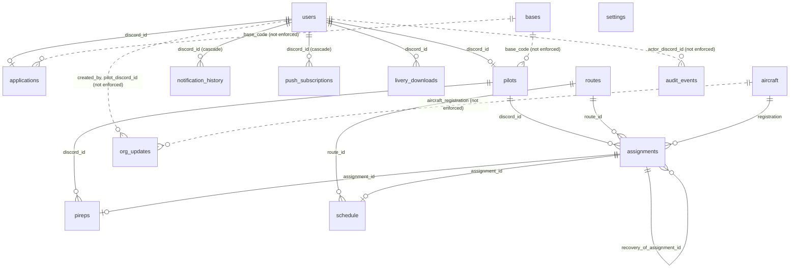
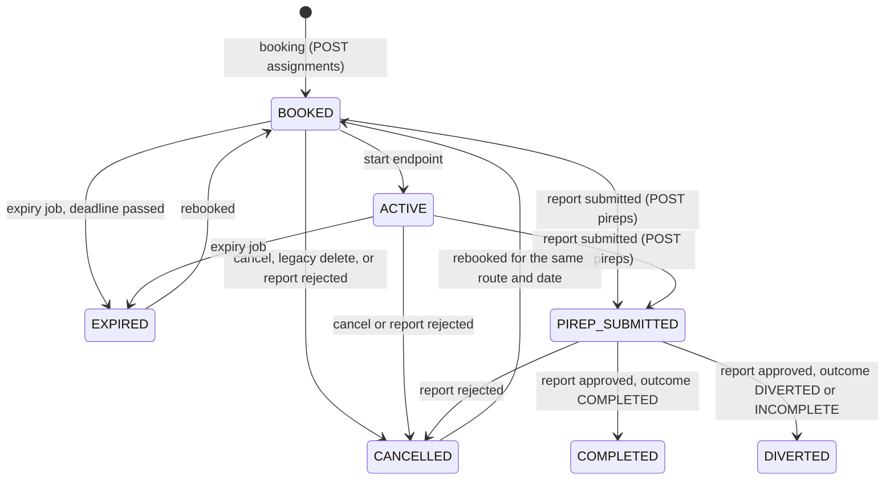

# Data model

This page documents every persistent entity in airDash: the fifteen tables and one sequence in the PostgreSQL schema `airdash`, their columns, constraints, indexes, and relationships, the lifecycles their status columns encode, how rows are created, changed, and deleted, what data is sensitive, and how the schema is migrated. The column listings were extracted from a database freshly created by `migrate()` at commit `5f2e27c` and match production, which reports the same fifteen tables.

## Overview

The schema models one airline. Identity comes from Discord: `users.discord_id` is the primary key for accounts and the foreign key everywhere else. Operations revolve around `assignments`, which link a pilot, a route, and an aircraft for one flight, and `pireps`, which record the outcome. Everything else is either reference data (`bases`, `aircraft`, `routes`), derived operational state (`schedule`, `notification_history`, `push_subscriptions`, `livery_downloads`), configuration (`settings`), communication (`org_updates`), or history (`audit_events`).



Solid lines are foreign keys the database enforces. Dotted lines are logical relationships that the application maintains but the database does not check: a pilot's `base_code` refers to `bases.code`, but deleting a base does not fail because of it; the API instead refuses to delete a base that pilots use. `||--o|` reads "one to zero or one"; `||--o{` reads "one to zero or many".

## Conventions

- Types are PostgreSQL types. `TEXT` is unbounded; length limits are enforced by the API's `clean()` function, not by the database. `TIMESTAMPTZ` is a timestamp with time zone, always stored in UTC. `BIGSERIAL` is a 64-bit integer with an automatic sequence. `JSONB` is binary JSON.
- "Null" means the column may hold `NULL`. A column with a default and `NOT NULL` is written "no, default …".
- Timestamps default to `NOW()`, the transaction start time.
- Every table name in SQL is qualified as `airdash.<table>`.

## Tables

### users

Purpose: a local cache of every Discord identity that has ever called an authenticated route, refreshed on each login by `syncUser`. It exists so that other tables can reference a stable key and display a name without calling the authentication service.

| Column | Type | Null | Meaning |
|---|---|---|---|
| `discord_id` | TEXT | no, primary key | Discord user ID (snowflake). |
| `username` | TEXT | no | Discord username at last login. |
| `display_name` | TEXT | no | Discord display name, or username when absent. |
| `avatar_url` | TEXT | yes | Discord avatar URL. |
| `account_status` | TEXT | no, default `'ACTIVE'` | `ACTIVE` or `DISABLED`. Never set to `DISABLED` by current code. |
| `created_at` | TIMESTAMPTZ | no, default now | First login. |
| `last_login_at` | TIMESTAMPTZ | no, default now | Updated on every `syncUser`. |

Constraints: `users_pkey (discord_id)`, `users_account_status_check`.

Created by: `syncUser` in `/me`, `/profile`, `/applications`, `/flights`. Updated by: the same upsert. Deleted by: nothing. Deleting a user cascades to `notification_history` and `push_subscriptions` but is blocked by `applications`, `pilots`, and `livery_downloads` foreign keys.

### applications

Purpose: one pilot application per Discord user, with the review decision.

| Column | Type | Null | Meaning |
|---|---|---|---|
| `id` | BIGSERIAL | no, primary key | |
| `discord_id` | TEXT | no, unique, references `users` | Applicant. |
| `preferred_name` | TEXT | no | Becomes the pilot display name on approval. |
| `vatsim_cid` | TEXT | no | VATSIM certificate ID, 4 to 12 digits. |
| `base_code` | TEXT | no | Requested base; must be active at submission. |
| `simulator` | TEXT | no | Free text such as `MSFS 2024`. Used to choose the default livery package. |
| `experience` | TEXT | no | Free text experience level. |
| `introduction` | TEXT | no, default `''` | Free text. |
| `status` | TEXT | no, default `'SUBMITTED'` | `SUBMITTED`, `UNDER_REVIEW`, `APPROVED`, `RETURNED`, `REJECTED`. `UNDER_REVIEW` is allowed by the constraint but never set by current code. |
| `reviewer_notes` | TEXT | no, default `''` | Owner notes; cleared on resubmission. |
| `reviewed_by` | TEXT | yes | Owner Discord ID. |
| `submitted_at` | TIMESTAMPTZ | no, default now | First submission. Not updated on resubmission. |
| `reviewed_at` | TIMESTAMPTZ | yes | |
| `updated_at` | TIMESTAMPTZ | no, default now | Set on resubmission and review. |

Constraints: `applications_pkey`, `applications_discord_id_key`, `applications_discord_id_fkey`, `applications_status_check`. A former `applications_base_code_check` was dropped by the migration so that bases can be added at runtime.

Lifecycle: `SUBMITTED` → `APPROVED` (creates a pilot) or `RETURNED` or `REJECTED`. A `RETURNED` or `REJECTED` application can be resubmitted, which resets it to `SUBMITTED`. Deleted by: nothing.

### pilots

Purpose: the approved pilot record: identity, profile, base, statistics, experience, rank, and integration settings.

| Column | Type | Null | Meaning |
|---|---|---|---|
| `discord_id` | TEXT | no, primary key, references `users` | |
| `pilot_number` | TEXT | no, unique | `AD` plus four digits from `pilot_number_seq`. |
| `display_name` | TEXT | no | Editable by the pilot. |
| `vatsim_cid` | TEXT | no | Copied from the application. |
| `base_code` | TEXT | no | Current base. |
| `status` | TEXT | no, default `'ACTIVE'` | `ACTIVE`, `LEAVE`, `INACTIVE`, `SUSPENDED`. Only `ACTIVE` pilots can book, view the directory, or appear publicly. |
| `total_block_minutes` | INTEGER | no, default 0 | Sum of credited block minutes from approved reports. |
| `total_flights` | INTEGER | no, default 0 | Count of approved reports. Recomputed from `pireps` by the migration. |
| `joined_at` | TIMESTAMPTZ | no, default now | Approval time. |
| `profile_image_url` | TEXT | yes | `/downloads/profiles/<id>.<ext>?v=<ts>` or an `https://` URL. |
| `pronouns` | TEXT | no, default `''` | |
| `about_me` | TEXT | no, default `''` | |
| `home_base_request` | TEXT | yes | Pending requested base code, or null. |
| `home_base_request_reason` | TEXT | no, default `''` | |
| `home_base_requested_at` | TIMESTAMPTZ | yes | |
| `missions_completed` | INTEGER | no, default 0 | Approved `COMPLETED` reports with `source='MISSION'`. |
| `assignments_completed` | INTEGER | no, default 0 | Approved `COMPLETED` reports with other sources. |
| `experience` | INTEGER | no, default 0 | Experience points. Backfilled from block minutes by the migration where zero. |
| `rank_name` | TEXT | no, default `'Captain'` | Display only. |
| `leadership_title` | TEXT | yes | Display only; set to `Founder & CEO` for the owner by the migration. |
| `public_profile_enabled` | BOOLEAN | no, default true | Controls inclusion in `/public`. No interface changes it. |
| `simbrief_username` | TEXT | yes | Used by `simbrief-fetch`. |

Constraints: `pilots_pkey`, `pilots_pilot_number_key`, `pilots_discord_id_fkey`, `pilots_status_check`.

Created by: application approval. Updated by: `/profile`, `/profile/image`, `/admin/pilots/:id/manage`, `/admin/pilots/:id/base`, report approval, and admin assignment deletion. Deleted by: nothing; blocked by `assignments` and `pireps` foreign keys.

### bases

Purpose: operating bases shown on maps, offered in applications, and used for hub health.

| Column | Type | Null | Meaning |
|---|---|---|---|
| `code` | TEXT | no, primary key | ICAO code, 3 or 4 uppercase letters. |
| `name` | TEXT | no | City or airport name. |
| `lat` | DOUBLE PRECISION | no | Latitude, -90 to 90. |
| `lon` | DOUBLE PRECISION | no | Longitude, -180 to 180. |
| `role` | TEXT | no, default `''` | Descriptive role such as `Headquarters`. |
| `is_active` | BOOLEAN | no, default true | Inactive bases are hidden and cannot be requested. |
| `sort_order` | INTEGER | no, default 100 | Display order. |
| `created_at` | TIMESTAMPTZ | no, default now | |

Constraints: `bases_pkey`. Seeded with `KATL`, `KDEN`, `MDSD`, `KGEG`. Created and updated by `POST /admin/bases`; deleted by `DELETE /admin/bases/:code` only when no pilot references the code.

### aircraft

Purpose: the fleet: identity, position, status, livery packages, and lifetime totals.

| Column | Type | Null | Meaning |
|---|---|---|---|
| `registration` | TEXT | no, primary key | Tail registration such as `N574AD`. Characters 2 to 4 form the three-digit "fin" or tail number. |
| `fleet_number` | INTEGER | no, unique | Same digits as the registration. |
| `aircraft_type` | TEXT | no, default `'BCS3'` | ICAO type. |
| `status` | TEXT | no, default `'AVAILABLE'` | `PLANNED`, `AVAILABLE`, `ASSIGNED`, `MAINTENANCE`, `INSPECTION`, `RETIRED`, `INACTIVE`. |
| `current_airport` | TEXT | no | Where the aircraft is parked. |
| `livery_url` | TEXT | yes | MSFS 2024 package path under `/downloads/liveries/`. |
| `livery_sha256` | TEXT | yes | SHA-256 of that package. |
| `livery_msfs2020_url` | TEXT | yes | MSFS 2020 package path. |
| `livery_msfs2020_sha256` | TEXT | yes | |
| `livery_msfs2020_download_count` | INTEGER | no, default 0 | |
| `total_block_minutes` | INTEGER | no, default 0 | Operational minutes from approved reports. |
| `total_cycles` | INTEGER | no, default 0 | One per approved report. |
| `created_at` | TIMESTAMPTZ | no, default now | |
| `current_gate` | TEXT | yes | Parking or departure gate; repaired at startup if null. |
| `status_reason` | TEXT | no, default `''` | Why the aircraft is on hold. |
| `status_until` | TIMESTAMPTZ | yes | When a timed hold ends; the expiry job releases it. |
| `status_set_by` | TEXT | yes | Owner Discord ID, or null for automatic holds. |
| `status_set_at` | TIMESTAMPTZ | yes | |
| `livery_name` | TEXT | yes | Special livery name, such as `FWA2027` for `N514AD`. |
| `special_livery` | BOOLEAN | no, default false | |
| `thumbnail_url` | TEXT | yes | Defaults to `/downloads/liveries/<reg lower>/thumbnail.png`. |
| `livery_download_count` | INTEGER | no, default 0 | MSFS 2024 downloads, anonymous and authenticated. |

Constraints: `aircraft_pkey`, `aircraft_fleet_number_key`, `aircraft_status_check`.

Lifecycle: `AVAILABLE` → `ASSIGNED` on booking → `AVAILABLE` on cancellation, expiry, rejection, or approval (at the new airport) → `INSPECTION` for 48 hours on a hard landing or owner action → `MAINTENANCE` or `RETIRED` by owner action. `PLANNED` and `INACTIVE` are allowed by the constraint but not set by current code. Seeded with 21 aircraft whose livery URLs and hashes are updated on every migration run.

### routes

Purpose: the published route network and hidden recovery routes.

| Column | Type | Null | Meaning |
|---|---|---|---|
| `id` | BIGSERIAL | no, primary key | |
| `flight_number` | INTEGER | no, unique | Displayed as `AIR<n>`; `9000` to `9999` are recovery ferries. |
| `origin` | TEXT | no | ICAO. |
| `destination` | TEXT | no | ICAO. |
| `block_minutes` | INTEGER | no, > 0 | Scheduled block time. |
| `days` | TEXT | no, default `'Daily'` | Display text; `Recovery ferry` marks recovery routes. |
| `status` | TEXT | no, default `'ACTIVE'` | `ACTIVE` or `INACTIVE`. |
| `created_at` | TIMESTAMPTZ | no, default now | |

Constraints: `routes_pkey`, `routes_flight_number_key`, `routes_block_minutes_check`, `routes_status_check`. Indexes: `routes_active_origin_destination` unique on `(origin, destination) WHERE status='ACTIVE'`; `routes_recovery_origin_destination` unique on `(origin, destination) WHERE status='INACTIVE' AND days='Recovery ferry'`. The original `UNIQUE(origin, destination)` constraint was dropped so that a recovery route can share a pair with an active route.

Seeded with 102 routes: 92 listed tuples and 10 generated from Spokane using great-circle distance. `INSERT ... ON CONFLICT (flight_number) DO NOTHING` means editing a seeded tuple does not change an existing row; see [change recipes](change-recipes.md#add-or-edit-a-route-flight). Recovery routes are created by `ensureRecoveryRoute`.

### schedule

Purpose: deterministic departures for today and tomorrow, so that the Schedule page has content without an owner maintaining timetables.

| Column | Type | Null | Meaning |
|---|---|---|---|
| `id` | BIGSERIAL | no, primary key | |
| `route_id` | BIGINT | no, references `routes` | |
| `dep_time` | TIMESTAMPTZ | no | Derived from a hash of route, day, and slot, between 05:00 and 23:00 UTC. |
| `arr_time` | TIMESTAMPTZ | no | `dep_time` plus block minutes. |
| `status` | TEXT | no, default `'OPEN'` | `OPEN`, `TAKEN`, `DEPARTED`, `COMPLETED`. `COMPLETED` is never set by current code. |
| `assignment_id` | BIGINT | yes, references `assignments` | Set when booked from the schedule. |
| `created_at` | TIMESTAMPTZ | no, default now | |

Constraints: `schedule_pkey`, `schedule_route_id_dep_time_key`, two foreign keys, `schedule_status_check`. Index: `schedule_dep_time`.

Lifecycle and retention: rows are inserted by `ensureSchedule`, become `TAKEN` on booking, return to `OPEN` if a `BOOKED` assignment is cancelled before departure, become `DEPARTED` when the time passes or a cancellation happens after departure, and are deleted six hours after departure. This is the only table with automatic deletion.

### assignments

Purpose: one pilot flying one route in one aircraft on one date, through its whole lifecycle.

| Column | Type | Null | Meaning |
|---|---|---|---|
| `id` | BIGSERIAL | no, primary key | |
| `route_id` | BIGINT | no, references `routes` | |
| `flight_date` | DATE | no | Operating date chosen by the pilot. |
| `discord_id` | TEXT | no, references `pilots` | |
| `registration` | TEXT | no, references `aircraft` | |
| `status` | TEXT | no, default `'BOOKED'` | `BOOKED`, `ACTIVE`, `PIREP_SUBMITTED`, `COMPLETED`, `DIVERTED`, `CANCELLED`, `EXPIRED`. |
| `booked_at` | TIMESTAMPTZ | no, default now | Reset on rebooking. |
| `started_at` | TIMESTAMPTZ | yes | Set by `/start`. |
| `cancelled_at`, `cancelled_by`, `cancellation_code`, `cancellation_reason` | TIMESTAMPTZ, TEXT, TEXT, TEXT | yes | Structured cancellation. Codes: the seven pilot reasons, `DEADLINE_EXPIRED`, `PIREP_REJECTED`. |
| `expires_at` | TIMESTAMPTZ | no, default now + 2 h 30 min | Filing deadline. Set to block minutes + 150 on booking and again on start. |
| `departure_gate`, `arrival_gate` | TEXT | yes | Assigned on booking; repaired at startup if missing. |
| `tail_number` | TEXT | yes | Registration characters 2 to 4. |
| `simbrief_url`, `simbrief_format` | TEXT | yes | Source URL and declared OFP layout. |
| `flight_plan` | JSONB | yes | The parsed SimBrief plan, including `alternate`, which the outcome analysis reads. |
| `file_vatsim` | BOOLEAN | no, default false | Pilot intends to file on VATSIM. |
| `volanta_tracking_consent` | BOOLEAN | no, default false | Set true on every booking by current code. |
| `volanta_tracking_url`, `volanta_tracking_data`, `volanta_last_synced_at` | TEXT, JSONB, TIMESTAMPTZ | yes | Linked Volanta flight. |
| `schedule_id` | BIGINT | yes | Schedule row booked from; not a foreign key. |
| `source` | TEXT | no, default `'BOARD'` | `BOARD`, `MISSION`, or `SCHEDULE`. Not constrained by the database. |
| `mission_type` | TEXT | no, default `'STANDARD'` | `STANDARD` or `RECOVERY`. |
| `recovery_of_assignment_id` | BIGINT | yes, references `assignments` | The diverted assignment a recovery ferry repairs. |

Constraints: `assignments_pkey`, `assignments_route_id_flight_date_discord_id_key` (one booking per pilot per route per date), four foreign keys, `assignments_status_check`, `assignments_mission_type_check`. Indexes: `assignments_active_aircraft` unique on `registration` where status is `BOOKED`, `ACTIVE`, or `PIREP_SUBMITTED`; `assignments_active_pilot` unique on `discord_id` under the same condition; `assignments_recovery_source_active` unique on `recovery_of_assignment_id` where not null and status is active, `COMPLETED`, or `DIVERTED`.

Lifecycle:



The frontend displays `ACTIVE` as `FLYING`. A `RETURNED` report leaves the assignment in `PIREP_SUBMITTED`; there is no path back to `ACTIVE`, and the pilot cannot submit again because `pireps.assignment_id` is unique. Deleted by: `DELETE /admin/assignments/:id` only.

### pireps

Purpose: the pilot report for one assignment, with Volanta evidence, review state, credit, and outcome.

| Column | Type | Null | Meaning |
|---|---|---|---|
| `id` | BIGSERIAL | no, primary key | |
| `assignment_id` | BIGINT | no, unique, references `assignments` | One report per assignment. |
| `discord_id` | TEXT | no, references `pilots` | |
| `actual_out_at` | TIMESTAMPTZ | no | Off blocks (real time). |
| `actual_off_at`, `actual_on_at` | TIMESTAMPTZ | yes | Takeoff and landing. |
| `actual_in_at` | TIMESTAMPTZ | no | On blocks or report end; must be after `actual_out_at`. |
| `landing_rate` | INTEGER | yes | Feet per minute, negative for descent; never zero. |
| `vatsim_flown` | BOOLEAN | no, default false | |
| `volanta_url`, `volanta_flight_id`, `volanta_data` | TEXT, TEXT, JSONB | yes | Source link, UUID, and the full normalized Volanta record. |
| `distance_nm`, `fuel_burn` | NUMERIC | yes | From Volanta. |
| `network` | TEXT | yes | `VATSIM` when `vatsim_flown`, else Volanta's network or `Offline`. |
| `callsign` | TEXT | yes | From Volanta. |
| `remarks` | TEXT | no, default `''` | Pilot remarks, up to 1500 characters. |
| `review_status` | TEXT | no, default `'SUBMITTED'` | `SUBMITTED`, `APPROVED`, `RETURNED`, `REJECTED`. |
| `review_notes` | TEXT | no, default `''` | |
| `reviewed_by` | TEXT | yes | Owner ID, or null for automatic approval. |
| `submitted_at`, `reviewed_at` | TIMESTAMPTZ | no default now, yes | |
| `credited_minutes` | INTEGER | yes | Total experience awarded (base plus streak bonus). The name is historical; it holds experience, not minutes. |
| `base_experience` | INTEGER | yes | Experience before the streak bonus. |
| `streak_bonus_experience`, `streak_bonus_percent` | INTEGER | no, default 0 | |
| `day_streak_at_award`, `continuity_streak_at_award` | INTEGER | yes | Streak values at approval time. |
| `sim_block_seconds`, `real_block_seconds` | INTEGER | yes | Simulator and real block durations. |
| `time_compression_ratio` | NUMERIC(7,3) | yes | Simulator over real. |
| `time_compression_detected` | BOOLEAN | no, default false | Ratio at or above 1.1 with at least 300 seconds difference. |
| `time_compression_reason` | TEXT | no, default `''` | Human-readable explanation when detected. |
| `outcome_type` | TEXT | no, default `'COMPLETED'` | `COMPLETED`, `DIVERTED`, `INCOMPLETE`. |
| `diversion_reason_code` | TEXT | yes | One of the nine reason codes when non-complete. |
| `diversion_details` | TEXT | no, default `''` | |
| `actual_destination` | TEXT | yes | Verified arrival airport when known. |
| `reposition_airport` | TEXT | yes | Where the aircraft is placed on approval. |
| `reposition_method` | TEXT | yes | `SCHEDULED_DESTINATION`, `VOLANTA_DIVERSION_AIRPORT`, `FILED_ALTERNATE_AFTER_MIDPOINT`, `ORIGIN_BEFORE_MIDPOINT`. |
| `progress_ratio` | NUMERIC(5,3) | yes | Distance flown over planned distance, capped at 1. |
| `credit_multiplier` | NUMERIC(4,3) | no, default 1.000 | 1.0 for completed, 0.9 otherwise. |
| `credited_block_minutes` | INTEGER | yes | Block minutes actually credited to the pilot. |

Constraints: `pireps_pkey`, `pireps_assignment_id_key`, two foreign keys, `pireps_check (actual_in_at > actual_out_at)`, `pireps_landing_rate_nonzero`, `pireps_outcome_type_check`, `pireps_review_status_check`.

**Note:** `credited_minutes` stores experience points, and `credited_block_minutes` stores minutes. The misleading name predates the experience system and was kept to avoid a data migration. Read the code, not the name.

Lifecycle: `SUBMITTED` → `APPROVED`, `RETURNED`, or `REJECTED`. Approval is the only transition with side effects on other tables; see `applyPirepReview` in the [API reference](api-reference.md#post-adminpirepsiddecision). Deleted by: `DELETE /admin/assignments/:id`.

### livery_downloads

Purpose: which livery package versions each pilot has downloaded, so the Hangar can show what is new.

| Column | Type | Null | Meaning |
|---|---|---|---|
| `discord_id` | TEXT | no, references `users` | |
| `registration` | TEXT | no | Not a foreign key. |
| `simulator` | TEXT | no, default `'MSFS2024'` | `MSFS2020` or `MSFS2024`. |
| `downloaded_at` | TIMESTAMPTZ | no, default now | Updated on each download. |

Constraints: `livery_downloads_pkey (discord_id, registration, simulator)`, `livery_downloads_discord_id_fkey`, `livery_downloads_simulator_check`. Created by the authenticated download routes; deleted by `POST /profile/liveries/reset`.

### org_updates

Purpose: announcements to pilots and public press releases. One table serves both; `is_public` separates them.

| Column | Type | Null | Meaning |
|---|---|---|---|
| `id` | BIGSERIAL | no, primary key | |
| `kind` | TEXT | no, default `'GENERAL'` | `GENERAL`, `OPERATIONS`, `FLEET`, `MAINTENANCE`, `NEW_PILOT`, `ACHIEVEMENT`, `LEVEL_UP`. Not constrained by the database. |
| `title` | TEXT | no | Up to 120 characters. |
| `body` | TEXT | no | Up to 1000 characters for private, 10000 for public. |
| `pilot_discord_id` | TEXT | yes | Related pilot. |
| `aircraft_registration` | TEXT | yes | Related aircraft. |
| `created_by` | TEXT | yes | Owner ID, or null for automatic updates. |
| `created_at` | TIMESTAMPTZ | no, default now | |
| `is_public` | BOOLEAN | no, default false | Public releases appear in `/news`. |
| `slug` | TEXT | yes | URL slug; lowercase letters, digits, single hyphens. |
| `summary` | TEXT | no, default `''` | Required for public releases; also used as the notification body. |
| `hero_image_url` | TEXT | yes | `/assets/news/...` or `https://`. |
| `author_name` | TEXT | no, default `'Staff Writer'` | Public byline. |
| `published_at` | TIMESTAMPTZ | yes | Public visibility requires this to be set and in the past. |

Constraints: `org_updates_pkey`, `org_updates_slug_format`. Indexes: `org_updates_created_at`, `org_updates_public_slug` unique on `slug` where not null, `org_updates_public_published` on `published_at DESC` where public.

Created by `POST /admin/org-updates` and by `publishOrgUpdate` on application approval (`NEW_PILOT`). The migration also contains a one-time `UPDATE` that publishes the Boeing 757 order release with a fixed slug; it matches on title and is a no-op once applied. Deleted by: nothing.

### audit_events

Purpose: an append-only record of every consequential change.

| Column | Type | Null | Meaning |
|---|---|---|---|
| `id` | BIGSERIAL | no, primary key | |
| `actor_discord_id` | TEXT | yes | Who acted; null for system jobs and automatic approvals. |
| `action` | TEXT | no | One of the 37 action names listed in the [API reference](api-reference.md#audit-actions). |
| `entity_type` | TEXT | no | `assignment`, `pilot`, `pirep`, `application`, `aircraft`, `base`, `org_update`, `settings`. |
| `entity_id` | TEXT | no | The affected row's key as text. |
| `details` | JSONB | no, default `{}` | Action-specific context. |
| `created_at` | TIMESTAMPTZ | no, default now | |

Constraints: `audit_events_pkey`. No foreign keys, so audit rows survive whatever they reference. Created by `audit()` after transactions commit. Updated and deleted by: nothing. There is no retention policy; the table grows indefinitely.

### settings

Purpose: operational settings as JSON documents.

| Column | Type | Null | Meaning |
|---|---|---|---|
| `key` | TEXT | no, primary key | `operations` is the only key. |
| `value` | JSONB | no, default `{}` | `{"autoApprovePireps": false}` by default. |
| `updated_at` | TIMESTAMPTZ | no, default now | |

Seeded by the migration; updated by `POST /admin/settings`. See [configuration](configuration.md#database-backed-settings).

### notification_history

Purpose: the server-side record of every notification shown to a user, with read and push state.

| Column | Type | Null | Meaning |
|---|---|---|---|
| `id` | BIGSERIAL | no, primary key | |
| `discord_id` | TEXT | no, references `users` on delete cascade | Recipient. |
| `event_key` | TEXT | no | `<group>:<identity>:<24 hex chars of SHA-256 of the record>`. A changed record produces a new key and therefore a new notification. |
| `kind` | TEXT | no | One of the nine groups: `applications`, `pireps`, `aircraft`, `baseRequests`, `progress`, `orgUpdates`, `expired`, `filingSoon`, `gateChanges`. |
| `title`, `body` | TEXT | no | Rendered text. |
| `href` | TEXT | no, default `'/portal#portal-updates'` | Where the notification links. |
| `payload` | JSONB | no, default `{}` | The source record. |
| `created_at` | TIMESTAMPTZ | no, default now | Taken from the source record's timestamp when available. |
| `read_at` | TIMESTAMPTZ | yes | Set by `POST /notifications/read`. |
| `pushed_at` | TIMESTAMPTZ | yes | Set by the push worker, or baselined on subscription. |

Constraints: `notification_history_pkey`, `notification_history_discord_id_event_key_key`, `notification_history_discord_id_fkey`. Indexes: `notification_history_user_created`, `notification_history_user_unread` partial on unread rows. Created by `syncNotificationHistory` from `/notifications`, `/admin/notifications`, subscription saves, and the push worker. No retention; the table grows.

### push_subscriptions

Purpose: browser push subscriptions.

| Column | Type | Null | Meaning |
|---|---|---|---|
| `endpoint` | TEXT | no, primary key | Push service URL, unique per browser. |
| `discord_id` | TEXT | no, references `users` on delete cascade | |
| `p256dh`, `auth` | TEXT | no | Client encryption keys. |
| `user_agent` | TEXT | no, default `''` | Truncated to 500. |
| `created_at`, `updated_at` | TIMESTAMPTZ | no, default now | |
| `last_success_at` | TIMESTAMPTZ | yes | |
| `last_error` | TEXT | no, default `''` | Last delivery error message. |
| `disabled_at` | TIMESTAMPTZ | yes | Never set by current code; the worker deletes dead subscriptions instead. |

Constraints: `push_subscriptions_pkey`, `push_subscriptions_discord_id_fkey`. Index: `push_subscriptions_user` partial on `disabled_at IS NULL`. Created and refreshed by `POST /push/subscriptions`; deleted by `DELETE /push/subscriptions` and by the worker on 404 or 410.

### Sequence: pilot_number_seq

`airdash.pilot_number_seq` starts at 1 and is consumed by `nextval` on application approval to form `AD0001`, `AD0002`, and so on. A rolled-back approval consumes a number without using it, which is normal PostgreSQL sequence behavior; gaps are expected.

## Transaction boundaries and consistency

| Operation | Boundary | Locks |
|---|---|---|
| Booking, recovery booking | One transaction from pilot lock to commit | `FOR UPDATE` on pilot, existing assignment, aircraft, and for recovery the source assignment and report |
| Cancellation, legacy deletion | One transaction covering assignment, aircraft, and schedule | `FOR UPDATE OF a` on the assignment |
| Report review and automatic approval | One transaction around `applyPirepReview` | `FOR UPDATE` on the report row |
| Application decision | One transaction covering application, pilot insert, and organization update | none explicit |
| Aircraft status change | One transaction | `FOR UPDATE` on the aircraft |
| Admin assignment deletion | One transaction covering pilot totals, reports, and assignment | none explicit |
| Assignment expiry | One transaction for the status and aircraft updates; audit and hold release outside it | none |
| Everything else | Single statements, each atomic on its own | none |

Audit rows are always written after the transaction commits, so a failed operation leaves no audit row. Reads use the default read-committed isolation; a page may therefore show a mixture of states if it issues several queries while a booking commits, which is acceptable because every page re-fetches after its own mutations.

Business uniqueness that must hold under concurrency is enforced by unique indexes rather than by application checks alone. The application checks exist to produce readable errors; the indexes exist to be correct.

## Sensitive data classification

| Data | Tables and columns | Classification | Exposure |
|---|---|---|---|
| Discord user ID | every `discord_id` column | Personal identifier, public within Discord | Public in `/live` and `/public` for active pilots. |
| Discord username, display name, avatar URL | `users`, exposed through joins | Personal, public within Discord | Public for active pilots; visible to the owner for every visitor. |
| VATSIM CID | `applications.vatsim_cid`, `pilots.vatsim_cid` | Personal identifier | Owner only. Never returned by a public route. |
| Pilot display name, pronouns, about me, profile image | `pilots` | Personal, pilot-controlled | Display name and image are public; pronouns and about-me are visible to signed-in pilots. |
| Application free text | `applications` | Personal | Owner only. |
| Flight records | `pireps.volanta_data`, `assignments.flight_plan` | Operational, may include Volanta account identifiers | Owner and the pilot. |
| Push subscription keys | `push_subscriptions.p256dh`, `auth`, `endpoint` | Credential-like | Never returned by any route. |
| Audit details | `audit_events.details` | Operational, may include reasons written by pilots | Owner only. |

No column stores passwords, session tokens, or email addresses. Database credentials and VAPID keys live in `api/.env`, not in the database.

## Migration behavior

`migrate()` in `api/src/database.js` is the only mechanism that changes the schema. It runs at every API start and can be run alone with `npm --prefix api run migrate`. It performs four kinds of work in order:

1. Creates the schema, the original tables, the sequence, and the original indexes with `IF NOT EXISTS`.
2. Applies every later change: `ADD COLUMN IF NOT EXISTS`, `DROP CONSTRAINT IF EXISTS` followed by `ADD CONSTRAINT`, `CREATE INDEX IF NOT EXISTS`, `CREATE TABLE IF NOT EXISTS` for the four newer tables, and guarded data corrections such as backfilling `total_flights`, nulling zero landing rates, and publishing one press release.
3. Seeds bases and the settings row with `ON CONFLICT DO NOTHING`.
4. Upserts the fleet (updating livery URLs and hashes on conflict) and inserts routes with `ON CONFLICT (flight_number) DO NOTHING`.

Properties and consequences:

- Idempotent: running it twice produces the same schema. Verified on a fresh database while writing this page: the second run printed the same completion message and changed nothing.
- Not versioned: there is no table recording which statements have run, and no numbered migration files. The file is read top to bottom every time.
- Not reversible: there is no down migration. Rolling back API source does not remove columns or constraints; see [deployment](deployment.md#roll-back-the-api).
- Not transactional as a whole: each `pool.query` call is its own transaction. A failure midway leaves earlier statements applied.
- Fails loudly: any error aborts startup. A `CHECK` constraint that existing rows violate is the classic cause.
- Grows without bound: every historical alteration remains in the file.

**Important:** Before deploying a migration that is anything other than a purely additive `IF NOT EXISTS` statement, take the [database backup](backup-and-recovery.md#database-backup) and read every data-changing statement. The [smoke test](testing.md#smoke-test) applies the migration to whatever database `DATABASE_URL` names, which on the production host is production.

## Inspection queries

Read-only queries that answer common questions. Substitute your connection method from [local development](local-development.md#database-inspection).

```sql
-- Table list
SELECT table_name FROM information_schema.tables WHERE table_schema='airdash' ORDER BY table_name;

-- Columns of one table
SELECT column_name, data_type, is_nullable, column_default FROM information_schema.columns
WHERE table_schema='airdash' AND table_name='assignments' ORDER BY ordinal_position;

-- Active assignments
SELECT id, discord_id, registration, status, booked_at, expires_at FROM airdash.assignments
WHERE status IN ('BOOKED','ACTIVE','PIREP_SUBMITTED') ORDER BY booked_at DESC;

-- Fleet position
SELECT registration, status, current_airport, current_gate, status_until FROM airdash.aircraft ORDER BY fleet_number;

-- Recent audit
SELECT created_at, actor_discord_id, action, entity_type, entity_id FROM airdash.audit_events ORDER BY created_at DESC LIMIT 30;

-- Table sizes
SELECT relname, n_live_tup FROM pg_stat_user_tables WHERE schemaname='airdash' ORDER BY n_live_tup DESC;
```
