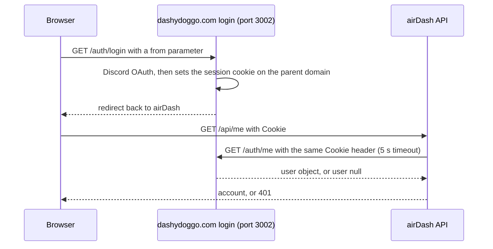

# Security

This page documents the verified security behavior of airDash: what is being protected, where the trust boundaries are, how authentication and authorization work, how secrets and input are handled, what is logged, which data is sensitive, which assumptions the design rests on, and how to report a problem. Every statement here was checked against the source at commit `5f2e27c` or against the running production system. Where a control does not exist, this page says so rather than implying one.

**Important:** The repository is public. This page deliberately omits credentials, private keys, and network details that are not already required to understand the design. Never add them.

## Assets

| Asset | Why it matters | Where it lives |
|---|---|---|
| Database credentials | Full read and write access to the shared `dashyden` database, which also holds other homelab services' data. | `DATABASE_URL` in `api/.env` on the production host. |
| VAPID private key | Allows anyone holding it to send push notifications to every subscribed airDash browser. | `VAPID_PRIVATE_KEY` in `api/.env`. |
| dashydoggo.com session cookies | Represent a signed-in Discord user across every dashydoggo.com service. | The user's browser; forwarded to the auth service by the API; never stored by airDash. |
| Owner role | Controls approvals, fleet, bases, announcements, and settings. | `OWNER_DISCORD_ID`, compared against the authenticated Discord ID. |
| Pilot personal data | VATSIM CIDs, Discord identities, free-text applications, flight records. | The `airdash` schema; see [data model](data-model.md#sensitive-data-classification). |
| Integrity of the operational record | Hours, experience, streaks, and aircraft state are the product's value. | `pilots`, `pireps`, `assignments`, `aircraft`, and `audit_events`. |
| Published downloads | Livery and GSX packages are installed into pilots' simulators. | `site/downloads/` on the production host, with SHA-256 values in the database and catalogs. |
| Availability of shared infrastructure | Caddy and PostgreSQL serve other dashydoggo.com services. | Docker containers `dashy-caddy` and `dashy-postgres`. |

## Trust boundaries

The [architecture](architecture.md#trust-boundaries) page draws the boundaries. This section states what is trusted on each side and which code enforces the crossing.

| Boundary | Trusted side | Untrusted side | Enforcement |
|---|---|---|---|
| Public internet to Caddy | Caddy and the host | Every client | TLS termination; only ports 80 and 443 are exposed; Caddy routes by path. |
| Caddy to Express | The API process | Every request, including headers | `app.set("trust proxy", 1)` trusts one hop of forwarding headers, the one Caddy adds. Global middleware sets response security headers and runs `requireAirDashOrigin`. |
| Express to handlers | Handler code | Request body, query, params, cookies | `requireUser` and `requireOwner` establish identity; handlers validate every input before use. |
| API to PostgreSQL | The database | Every value derived from a request | Parameterized queries only; `CHECK` constraints and unique indexes reject invalid states regardless of application bugs. |
| API to the auth service | The response `user` object | The cookie value | The cookie is forwarded opaquely; the API never parses it. A five-second timeout and any non-2xx or malformed response yields "not authenticated". |
| API to SimBrief and Volanta | Nothing | The remote response | HTTPS only; host and path allow-lists for SimBrief; UUID extraction for Volanta; size limits (2 MB and 16 MB) and timeouts (15 s and 20 s); responses parsed as XML text or JSON and never evaluated. |
| Browser to API | The API | The browser | The browser is treated as untrusted. Hidden controls are a convenience; every rule is re-checked server-side. |
| API to filesystem | The filesystem | Request content | Only `POST /profile/image` writes files, with a type allow-list, size limits, and a file name derived from the authenticated user's ID, never from the request. |

## Authentication flow

Authentication is delegated entirely to the dashydoggo.com Discord login service. airDash does not store passwords, tokens, or sessions.

1. The browser's "sign in" button navigates to `https://dashydoggo.com/auth/login?from=<current url>`. That service performs Discord OAuth and sets its session cookie for the dashydoggo.com parent domain, then redirects back.
2. On every authenticated request the API's `authenticatedUser(cookie)` in `api/src/auth.js` forwards the raw `Cookie` header to `AUTH_URL` with `AbortSignal.timeout(5000)`.
3. If the response is 2xx and its body has `user.id`, the user object becomes `req.user`. Any other outcome, including timeout, network failure, non-2xx status, or a body without `user.id`, returns `null`.
4. `requireUser` responds `401 Discord sign-in required` when the user is `null`. `requireOwner` responds `403 Owner access required` when the user is `null` or `user.id !== OWNER_ID`.
5. "Sign out" posts to `https://dashydoggo.com/auth/logout` with credentials and reloads. airDash holds nothing to clear.

Properties: the function fails closed; the cookie is never logged, stored, or parsed by airDash; the API cannot forge a user because identity comes only from the auth service's response. The dependency is that the auth service on port 3002 is trusted completely; if it is compromised, every airDash identity is compromised.

## Authorization model

Authorization is role-based with four cumulative levels, enforced by middleware and in-handler checks. The [API reference](api-reference.md) lists the class of every route.

| Level | Check | Where |
|---|---|---|
| Public | none | Nine routes: health, public data, news, hub health, live, schedule, anonymous livery downloads. |
| Authenticated | `requireUser` | Thirty-five routes. |
| Pilot | `SELECT ... FROM airdash.pilots WHERE discord_id=$1 AND status='ACTIVE'` inside the handler, or a `pilots` row for profile routes | Booking, missions, directory, profile, and dispatch routes. The frontend hides these pages for non-pilots, and the API repeats the check. |
| Owner | `requireOwner` | Thirteen `/admin/*` routes. |

Ownership of records is enforced in SQL: every assignment route includes `AND a.discord_id=$2` with the caller's ID, so a pilot cannot start, cancel, or attach data to another pilot's assignment even by guessing its ID. Report submission checks the assignment belongs to the caller. The pilot directory (`GET /pilots/:id`) deliberately allows any active pilot to read any pilot's public entry.

Unresolved by design: `GET /admin/pilots/:id/flights` and other owner routes return data for any ID without confirming the pilot exists; this leaks nothing because only the owner can call them.

## Cross-site request forgery

`requireAirDashOrigin` runs before every route. Non-read methods must carry an `Origin` header equal to `https://air.dashydoggo.com` or `http://localhost:5174`; otherwise the response is `403 Invalid request origin`. Browsers always attach `Origin` to cross-origin requests and to same-origin `POST` requests, and a malicious site cannot set it to another origin, so a forged request from another site is rejected before authentication is consulted. This was verified against production. The check does not protect `GET` routes, which is correct because they have no side effects except counters and cache-safe writes (`syncUser`, notification history synchronization, schedule maintenance), none of which an attacker benefits from triggering.

There is no CSRF token and no `SameSite` control within airDash; the cookie's attributes are set by the dashydoggo.com login service.

## Secret management

| Secret | Storage | Rotation |
|---|---|---|
| Database password | `api/.env`, mode `600`, untracked | Change in PostgreSQL, update `.env`, `pm2 restart airdash-api`. |
| VAPID private key | `api/.env` | Generate a new pair; every browser must resubscribe because subscriptions are bound to the public key. |
| GitHub credentials for the operator | Outside the repository | Not part of the application. |

Rules that hold at this commit and were verified: no secret appears in any tracked file; the frontend bundle contains no environment variable values (the frontend has no runtime configuration); `.gitignore` excludes `.env` and `.env.*` except `.env.example`; `api/.env.example` contains placeholders only. The only client-side key of any kind is a CARTO basemap API key embedded in `web/src/App.tsx` and `web/src/AdvancedNetworkMap.tsx`. It is inherently public because every visitor's browser receives it, it authorizes only tile requests, and it is recorded in [known limitations](known-limitations.md#a-carto-basemap-key-is-embedded-in-the-frontend).

**Warning:** Never paste `api/.env` contents into an issue, a pull request, a chat, or documentation. Never commit a file that starts with `.env`.

## Input validation

Every request value passes through at least one of the following before it influences a query or a file:

| Control | Implementation | Applies to |
|---|---|---|
| Trim and truncate | `clean(value, max)` in `server.js` | Every text field; maximum lengths per field are in the [API reference](api-reference.md). |
| Allow-lists | Explicit arrays, `Set`s, or `Map`s for statuses, decisions, kinds, cancellation reasons, diversion reasons, simulators | Every enumerated field. |
| Regular expressions | Dates (`^\d{4}-\d{2}-\d{2}$`), VATSIM CID (`^\d{4,12}$`), ICAO codes (`^[A-Z]{3,4}$`), SimBrief username, slug format, image data URLs, SimBrief XML URLs | Structured strings. |
| Numeric coercion and bounds | `Number()`, `Number.parseInt`, `Number.isFinite`, `Math.min`, `Math.max` | Pagination, coordinates, landing rate, IDs. |
| Parameterized SQL | `$1`, `$2`, ... with a values array on every query | All database access. The only dynamic SQL fragments are column names chosen from a fixed map (`liveryPackageSpec`) and sort direction chosen from two literals; no request text is ever concatenated. |
| Database constraints | `CHECK`, `UNIQUE`, `NOT NULL`, foreign keys, partial unique indexes | Defense in depth behind the application checks. |
| Body size | `express.json({ limit: "2mb" })` | Every request body. |
| Upload limits | Type allow-list, 128 byte minimum, 1,500,000 byte maximum on the decoded image | `POST /profile/image`. |

Free-text fields (`about_me`, `remarks`, `introduction`, announcement bodies) are stored as entered and rendered by React, which escapes text by default. No field is rendered with `dangerouslySetInnerHTML`; this was verified by searching the frontend source.

## Output encoding and browser protections

- React escapes all interpolated text, which prevents stored cross-site scripting from free-text fields.
- The API sets `X-Content-Type-Options: nosniff`, `X-Frame-Options: DENY`, and `Referrer-Policy: strict-origin-when-cross-origin` on every response. Nginx adds `nosniff` on `/downloads/`.
- There is no `Content-Security-Policy` header. The frontend loads fonts from Google, tiles from CARTO and RainViewer, and images from URLs pilots supply (`profile_image_url`, `hero_image_url`), so a strict policy would require an allow-list; this is recorded as a limitation.
- Express sends `X-Powered-By: Express`. This discloses the framework and is a minor information leak; disabling it is a one-line change recorded in [known limitations](known-limitations.md).
- Pilot-supplied image URLs must be `https://` or a `/downloads/profiles/` path, and news images must be `/assets/news/` or `https://`. These are rendered as ``, which cannot execute script.

## Session and token handling

airDash holds no sessions and issues no tokens. Cookie forwarding to the auth service is the entire mechanism. The service worker's fetch calls to `/api/notifications/read` and `/api/push/subscriptions` use `credentials: "include"`, so they carry the same cookie.

Push subscriptions store the browser's `endpoint`, `p256dh`, and `auth` values. These allow sending encrypted messages to that browser and nothing else. They are never returned by any route.

## Encryption in transit and at rest

In transit: Caddy terminates TLS for `https://air.dashydoggo.com` with automatically managed certificates. Traffic from Caddy to Nginx travels over the Docker `docker_web` network, and from Caddy to the API over the Docker bridge to the host, both in plain HTTP on the same machine. The API's calls to SimBrief, Volanta, and push services use HTTPS. The API's call to the auth service is plain HTTP to `127.0.0.1`.

At rest: the PostgreSQL volume `docker_pgdata` and the `site/` directory are not encrypted by the application. Disk encryption, if any, is a host concern outside this repository. Database backups written to `/opt/dashy-database/backups/` are created with `umask 077` so only the operator can read them.

## Dependency security

The API has 4 direct dependencies and 96 packages in total; the frontend has 13 direct dependencies and 68 lock entries, 32 of them optional platform-specific packages. All versions are pinned exactly and locked with integrity hashes. `npm --prefix api audit` and `npm --prefix web audit` were run on September 10, 2026 and both reported `found 0 vulnerabilities`. Run them again before each release. There is no automated dependency scanning (no Dependabot configuration and no CI). The [contributing](contributing.md) page requires that any version change be its own reviewed commit.

## Audit logging

Every mutation writes an `airdash.audit_events` row after its transaction commits, recording the actor (or `NULL` for system actions), the action name, the entity type and ID, and JSON details. The 37 action names are listed in the [API reference](api-reference.md#audit-actions). The table has no foreign keys, is never updated or deleted by application code, and is readable in the Administration Audit tab (latest 500) or by SQL. It is not tamper-evident: anyone with database write access can alter it. There is no retention policy.

What is not logged: successful reads, authentication attempts, and failed authorization. The API logs `[airdash:pirep]` context on report failures and `[airdash-notifications]` and `[airdash-push]` failures to stderr, which PM2 captures in `~/.pm2/logs/airdash-api-error.log`. Logs never include cookie values.

## Sensitive data handling

The [data model](data-model.md#sensitive-data-classification) classifies every column. The rules that follow from it:

- `GET /live` and `GET /public` are public and return Discord IDs, display names, avatars, pilot numbers, and statistics for active pilots. Do not add columns to these routes without checking the classification; VATSIM CIDs, pronouns, about-me text, application text, and reviewer notes must never appear in a public route.
- `GET /admin/overview` returns every visitor who signed in but never applied (`visitors`). This is intentional owner-only visibility.
- Profile images are stored under a file name derived from the Discord ID, which reveals the ID to anyone who can guess the URL. The ID is already public in `/public` for active pilots.
- Volanta records stored in `pireps.volanta_data` may contain Volanta account details; they are returned only to the pilot and the owner.

## Secure configuration defaults

| Setting | Default | Security effect |
|---|---|---|
| `autoApprovePireps` | `false` | Reports require owner review unless the owner opts in. |
| `public_profile_enabled` | `true` | New pilots appear on the public site. There is no interface to opt out; this is a product decision, not an oversight, and it is listed under limitations. |
| `volanta_tracking_consent` | set `true` on every booking | Consent is recorded but not optional in the current interface. |
| VAPID keys | empty | Push is disabled until configured. |
| `AUTH_URL` | production auth service | Correct for production only; a local installation must override it. |

## Known assumptions

- The dashydoggo.com login service is trustworthy and reachable only from the host.
- The production host is single-tenant for the `dashy` user; anyone with a shell as that user has full control, including reading `api/.env`.
- Pilots are members of a small community; the design accepts that a pilot could submit misleading Volanta links, and relies on owner review and the Volanta record itself to detect it.
- Caddy is the only listener on public ports. The API's `0.0.0.0:3006` and PostgreSQL's `0.0.0.0:5432` bindings are reachable from the local network; firewall rules are a host concern outside this repository and were not audited while writing this page.
- SimBrief and Volanta return well-formed data; malformed data is rejected, not sanitized into acceptance.

## Vulnerability reporting

Report suspected vulnerabilities privately to the owner through the dashydoggo.com Discord server or by direct message on Discord to `@dashydoggo`. Do not open a public GitHub issue for a security problem, because the repository is public. Include the route or component, the steps to reproduce, and the impact you believe it has. There is no bug bounty and no formal service-level commitment; the owner is one person.

## Common unsafe modifications

The following changes look convenient and would weaken a control. Do not make them without a security review.

| Modification | Why it is unsafe |
|---|---|
| Adding an origin to `requireAirDashOrigin` | Every added origin can perform authenticated mutations in a signed-in user's browser. |
| Exposing an `/admin/*` route without `requireOwner` | Full loss of the owner boundary. |
| Building SQL with template strings that include request values | SQL injection. Use `$n` parameters. |
| Reading a file path from the request in a download route | Path traversal. Redirect only to stored `/downloads/liveries/` values as the current code does. |
| Accepting `http://` image URLs or arbitrary `data:` URLs in profiles | Mixed content and enlarged attack surface. |
| Increasing `express.json` or upload limits without need | Memory exhaustion by a single client. |
| Returning `error.message` for unexpected errors | Leaks internal details; the current code returns a generic message when `error.status` is absent. |
| Logging `req.headers.cookie` | Session theft from log files. |
| Adding columns to `/live` or `/public` | Possible disclosure of personal data; check the classification first. |
| Copying production `api/.env` to another machine | Spreads the database password and VAPID private key. |

## Incident response

There is no formal incident process. If you believe credentials or the owner account are compromised: rotate the database password and VAPID keys (see [secret management](#secret-management)), restart the API, review `airdash.audit_events` for unexpected actions, and inform the owner through Discord. Recovery procedures for data are in [backup and recovery](backup-and-recovery.md).
